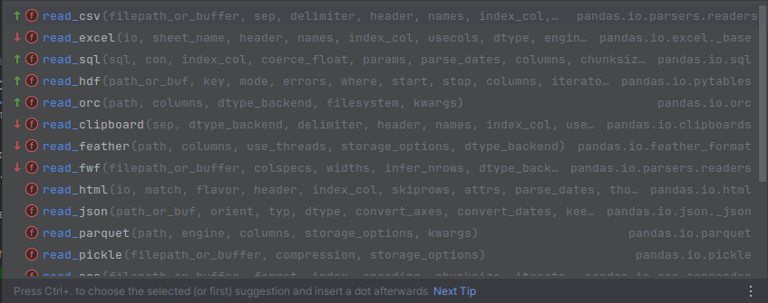

# Aula 5--Pandas

### Biblioteca de entrada de bases de dados e DataFrames
- Necessita estar presente no ambiente... ver: - [Instalação do Python, VS Code e ferramentas essenciais]({{ site.baseurl }}/configuracao/)

Teste: 

```python
import pandas as pd
print(pd.__version__)
```

```python
# Ajuste rápido
# No terminal
pip install pandas
```

## Pandas básico. Seguido de mão-na-massa com base simples. Seguido leitura real.

- **Pandas se utilizem de DataFrames que contém linhas e colunas nomeadas.** 

- **Ou pelo nome da coluna ou pelo index da linha!**

No intuito de treinar, antes de ler bases reais, podemos entrar com dados em formato de dicionário, com as chaves correspondendo aos nomes de colunas e valores em formato de listas. A título de exemplo...

```python

data = {
    'name': ['Joao', 'Jose', 'Maria', 'Antonia', 'Luiza'],
    'city': ['BH', 'Brasília', 'Rio', 'Macaé', 'Porto Seguro'],
    'id': [41, 28, 33, 34, 38],
    'py-score': [88.0, 79.0, 81.0, 80, 0]
}

data = pd.DataFrame(data)
```

1. Quando não há explicitação de `index`, as linhas são numerados de 0 até `len(dados)`. Ou seja, quando as linhas não são explicitamente nomeadas. 

### Examinando os dados *no console*

1. `data.head()`  # Cinco elementos é o default. Aceita qualquer n.  `data.head(20)`
2. `data.tail()`  # Últimos elementos.
3. Muito útil `data.columns`  # Nomes de colunas, pois head pode suprimir dados, quando há muitas colunas
4. Simplesmente `data` *no console*, lista primeiros e últimos dados e colunas.
5. `data['city']`  # Seleciona a coluna com o nome da coluna entre colchetes
    - Se quiser, pode utilizar `.iloc` para acessar o índice (número da coluna, ou da linha)
    - Caso não haja espaço no nome da coluna, pode-se usar diretamente ponto `data.city`

### Note. Indexing similar ao de listas, mas agora com [linha, coluna]
6. `data.loc[2, 'id']`  # Acessa a linha 2 e a coluna id
7. `data.loc[2]`  # Acessa a linha 2 toda
8. `data.loc[:, 'py-score']`  # Acessa a coluna toda. 
- Claro, nesse caso, você pode acessar os métodos da série
9. Por exemplo: `data.loc[:, 'py-score`].mean()
10. Também é possível `data['py-score'].mean()`  # Mas para modificar a coluna, prefira sempre `data.loc[:, 'col']`

### Mais exames na sua tabela...

11. `data.info()`  # Identifica tipo de objeto e non-nulls
12. `data.describe()`  # Média, min, max, quantiles... para numeric columns
13. `data[col].value_counts()`  # Calcula números de itens de uma *Series* == coluna

### Adding new column and data

1. Mamão com açúcar:
- `data['nova_coluna'] = lista de dados ou valor` (100)
- `data.loc[:4, 'nova_coluna'] = valor`  # Adiciona valor em todas as linhas até o index 4, inclusive. 

### Deleting column--muita calma nessa hora

1. `data = data.drop('nome_coluna', axis=1)`  # axis=1 é coluna axis=0 é linha.

**Note, precisa re-atribuir! ou usar inplace=True**

### IMPORTANTE: Seleção e filtro
- Lógica: `minha_base[]` dentro do colchete condição booleana. 
- Note que é necessário repetir a base e a coluna na condição... por exemplo
- Condição booleana: `minha_base['py-score'] > 80`
- **Coloca a condição como coluna, dentro da minha_base, juntando**
- `minha_base[minha_base['py-score'] > 80]]`


### Criando pandas DataFrames
1. Com dicionários, como exemplificado
2. Com nested lists, ou numpy.arrays, explicitando nomes de colunas.
    - Caso contrário, colunas, como indexes, quando não explicitados são numéricos, começando em 0. 
    - `import numpy as np`
    - `data = pd.DataFrame(np.array([[1, 2, 3], [4, 5, 6], [7, 8, 9]]))`
    - `data = pd.DataFrame(np.array([[1, 2, 3], [4, 5, 6], [7, 8, 9]]), columns=['x', 'y', 'z'], 
    index=['a', 'b', 'c'])`


### Lendo DataFrames from data


### Gotcha you! Erros leitura CSV

1) Codificação de caracteres (acentos quebrados)

- Arquivos vêm em latin-1, cp1252 ou iso-8859-1, não em utf-8.

- Erro típico: `UnicodeDecodeError`

`df = pd.read_csv('arquivo.csv', encoding='latin-1')`

2) Separador diferente

- Muitos .csv brasileiros usam **;** em vez de **,**

`df = pd.read_csv('arquivo.csv', sep=';')`

3) Decimal com vírgula

`df = pd.read_csv('arquivo.csv', sep=';', decimal=',')`

4) Colunas com problemas invisíveis, espaços antes/depois do nome, caracteres estranhos

`df.columns = df.columns.str.strip()`

5) Ler primeiras linhas quando há erro

- Arquivos quebrados, cabeçalhos ruins, metadados no topo.

`pd.read_csv('arquivo.csv', sep=';', nrows=10)`


6) Header ausente ou bagunçado
`df = pd.read_csv('arquivo.csv', sep=';', header=None)`


- Ou pular linhas de cabeçalho de metadados:

`df = pd.read_csv('arquivo.csv', skiprows=2)`

8) Grande demais → ler um pedaço

`df = pd.read_csv('arquivo.csv', nrows=50000)`

- Ou só algumas colunas:

`df = pd.read_csv('arquivo.csv', usecols=['UF', 'ANO', 'POP'])`

- Thousands

`df = pd.read_csv('arquivo.csv', sep=';', decimal=',', thousands='.')`

### Exercício --lendo base `data/economia_br_firms.csv`

1. Firmas com >100 empregados
2. Setor de tecnologia fora de SP
3. Cidades com desemprego > 12%
4. Produtividade: revenue / employees
5. Média de empregados por setor
6. Faturamento médio por estado
7. Massa salarial total por região
8. Top 5 maiores faturamentos

### `pandas_econ.csv.py`

### `pandas_practical.py`
